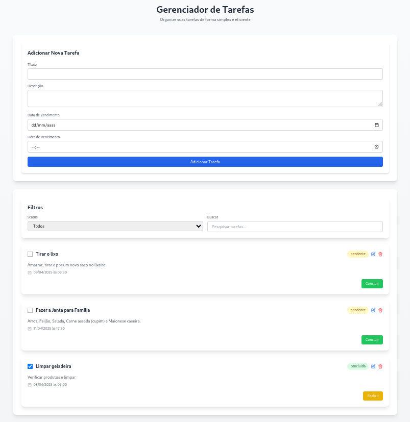

# Gerenciador de Tarefas



## Sobre o Projeto

O Gerenciador de Tarefas é uma aplicação moderna e eficiente desenvolvida com Vue.js 3 e TypeScript. Com uma interface intuitiva e responsiva, este aplicativo oferece uma experiência excepcional para gerenciar suas tarefas diárias.

## Tecnologias Utilizadas

- **Frontend**
  - Vue.js 3 com Composition API
  - TypeScript
  - Tailwind CSS para estilização
  - Vite como bundler
  - Axios para requisições HTTP

- **Backend**
  - Node.js com Express
  - fs-extra para operações com arquivos
  - CORS para requisições cross-origin

## Funcionalidades

- Adicionar novas tarefas com título, descrição, data e hora de vencimento
- Visualizar lista de tarefas em uma interface amigável
- Editar tarefas existentes
- Excluir tarefas
- Marcar tarefas como concluídas
- Organização visual com cards
- Interface responsiva
- Validação de dados
- Persistência de dados em arquivo JSON

## Instalação

1. Clone o repositório
```bash
git clone https://github.com/ricardobarbosrr/taskmanager.git
```

2. Instale as dependências do frontend
```bash
cd frontend
npm install
```

3. Instale as dependências do backend
```bash
cd backend
npm install
```

4. Inicie o servidor backend
```bash
node server.js
```

5. Inicie o frontend em outro terminal
```bash
npm run dev
```

6. Acesse a aplicação em `http://localhost:5173`

## Estrutura do Projeto

```
frontend/
├── src/
│   ├── components/      # Componentes Vue
│   ├── services/        # Serviços de API
│   ├── types/          # Tipos TypeScript
│   ├── App.vue         # Componente principal
│   └── main.ts         # Ponto de entrada
└── public/             # Arquivos estáticos

backend/
├── server.js          # Servidor Express
└── tasks.json         # Arquivo de dados
```

## API Endpoints

- `GET /api/tasks` - Lista todas as tarefas
- `POST /api/tasks` - Adiciona uma nova tarefa
- `PUT /api/tasks/:id` - Atualiza uma tarefa existente
- `DELETE /api/tasks/:id` - Exclui uma tarefa

## Scripts Disponíveis

```bash
# Frontend
# Iniciar o servidor de desenvolvimento
npm run dev

# Compilar para produção
npm run build

# Visualizar build em produção
npm run serve

# Backend
# Iniciar o servidor
node server.js
```

## Contribuindo

1. Faça um fork do projeto
2. Crie uma branch para sua feature (`git checkout -b feature/AmazingFeature`)
3. Commit suas mudanças (`git commit -m 'Add some AmazingFeature'`)
4. Push para a branch (`git push origin feature/AmazingFeature`)
5. Abra um Pull Request

## Licença

Este projeto está sob a licença MIT. Veja o arquivo [LICENSE](LICENSE) para mais detalhes.

## Agradecimentos

- Vue.js e sua comunidade
- Tailwind CSS
- Vite
- TypeScript

## Links

- [Documentação do Vue.js](https://vuejs.org/)
- [Documentação do Tailwind CSS](https://tailwindcss.com/)
- [Documentação do Vite](https://vitejs.dev/)
